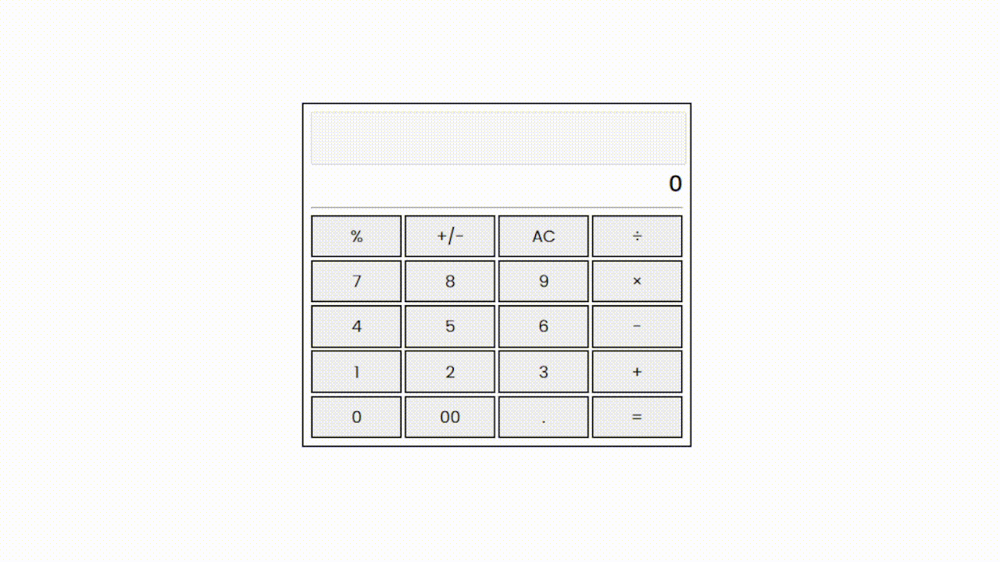

# Calculator (HTMLCSSJS)

`June 18, 2026` `HTML` `CSS` `JS` 
Another small project to practice JavaScript fundamentals like DOM manipulation, arrays, loops, string handling, and turning button clicks into working calculations. I also experimented with dynamically generating the calculator UI instead of hardcoding every button. 

Disclaimer: 
The core calculator functionality is working, but some features are still unfinished, such as +/- toggling, operator replacement, deleting the last input, and proper error handling for invalid expressions.

